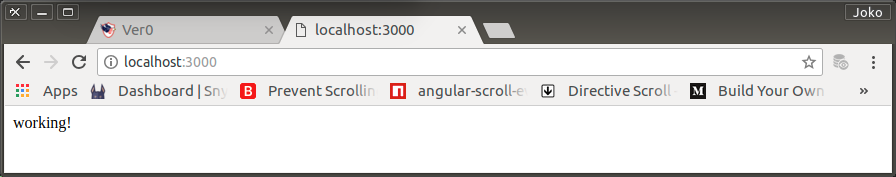

# Preparation

Semua aplikasi yang sedang dan akan terlibat di Sistem Informasi untuk Texal-Oil harus dilayani oleh sebuah REST Server yang memiliki kinerja baik.

Tidak hanya terkait dengan layanan data saja, tetapi juga dapat melayani API untuk aplikasi-aplikasi yang bersangkutan.

## Membentuk Environment

0. Check installed tools

    ```bash
    $ node --version

    v8.10.0

    $ npm --version

    6.0.1

    $ express --version

    4.16.0
    ```

1. Buat direktori di dalam texal/.

    ```bash
	$ mkdir rest0
    ```

2. Hop ke direktori baru tersebut dan lakukan inisiasi server.

    ```bash
    $ cd ver0
    $ git init
    $ npm init

    This utility will walk you through creating a package.json file.
    It only covers the most common items, and tries to guess sensible defaults.

    See `npm help json` for definitive documentation on these fields
    and exactly what they do.

    Use `npm install <pkg>` afterwards to install a package and
    save it as a dependency in the package.json file.

    Press ^C at any time to quit.
    package name: (rest0) 
    version: (1.0.0) 0.0.0
    description: REST Server for All Applications of Texal Project
    entry point: (index.js) 
    test command: 
    git repository: 
    keywords: rest, api, server, nodejs, expressjs, js
    author: Joko Wandyatmono
    license: (ISC) MIT
    About to write to /home/wandyatmono/projects/texal/rest0/package.json:

    {
        "name": "rest0",
        "version": "0.0.0",
        "description": "REST Server for All Applications of Texal Project",
        "main": "index.js",
        "directories": {
            "doc": "docs"
        },
        "scripts": {
            "test": "echo \"Error: no test specified\" && exit 1"
        },
        "keywords": [
            "rest",
            "api",
            "server",
            "nodejs",
            "expressjs",
            "js"
        ],
        "author": "Joko Wandyatmono",
        "license": "MIT"
    }

    Is this OK? (yes) 
    ```

3. Install expressJS

    Walaupun sudah tersedia secara global, tetapi agar repository tidak melewatkan seluruh dependencies yang seharusnya tertera, maka `express` saya install secara lokal.

    ```bash
	$ npm install express --save

    npm WARN rest0@0.0.0 No repository field.

    + express@4.16.3
    added 50 packages from 47 contributors in 9.867s
    [+] no known vulnerabilities found [119 packages audited]
    ```

    Selain telah tercipta direktori `node_modules` dengan segala isinya, `package.json` ter-update dengan isinya menjadi sebagai berikut:

    ```json
    {
        "name": "rest0",
        "version": "0.0.0",
        "description": "REST Server for All Applications of Texal Project",
        "main": "index.js",
        "directories": {
            "doc": "docs"
        },
        "scripts": {
            "test": "echo \"Error: no test specified\" && exit 1"
        },
        "keywords": [
            "rest",
            "api",
            "server",
            "nodejs",
            "expressjs",
            "js"
        ],
        "author": "Joko Wandyatmono",
        "license": "MIT",
        "dependencies": {
        "express": "^4.16.3"
        }
    }
    ```

    Perhatikan versi expressJS yang diinstall oleh npm di dependencies property.

## Membuat Dumb Server

0. Untuk memeriksa bahwa lingkungan benar-benar telah siap, buat sebuah server index.js, seperti telah disebut di package.json

    ```bash
	$ touch index.js
    ```

1. Script,

    `index.js`

    ```javascript
    /*
    Akses expressJS di-assign ke variable express
    Membuat instant aplikasi berbasis express bernama app
    */
    var express = require("express");
    var app = express();

    /*
    Routing untuk root. Jika request url hanya '/' alias root, response untuk browser adalah sebuah string 'working!'.
    */
    app.get('/', function(req,res) {
        res.send('working!');
    });

    /*
    Aplikasi app berjalan dengan port 3000 dan setelah port diinisiasi, ke system console dikirim sebuah string, "REST Server running on port 3000"
    */
    app.listen(3000, function() {
        console.log('REST Server running on port 3000');
    });
    ```

2. Jika aplikasi dijalankan dan tidak diketemukan adanya error, berarti expressJS sudah berjalan dengan baik dan aplikasi siap dikembangkan agar bisa menerima request dari browser.

    ```bash
    $ node index.js
    
    REST Server running on port 3000
    ```

	Dengan browser, masukkan url http://localhost:3000/
	Jika REST Server jalan, hasilnya akan terlihat seperti berikut ini

<p align="center">
	
    <br />
    Figure: 000-a-rest-trial.png
</p>

## Commit

Setelah remote repository bernama `texal-rest0`, arahkan local-repository kepadanya dan lakukan `commit` dan `push`

    ```bash
    $ git remote add origin https://github.com/wandyatmono/texal-rest0.git
    $ git add .
    $ git commit -m "Preparation"
    $ git push -u origin master
    ```
